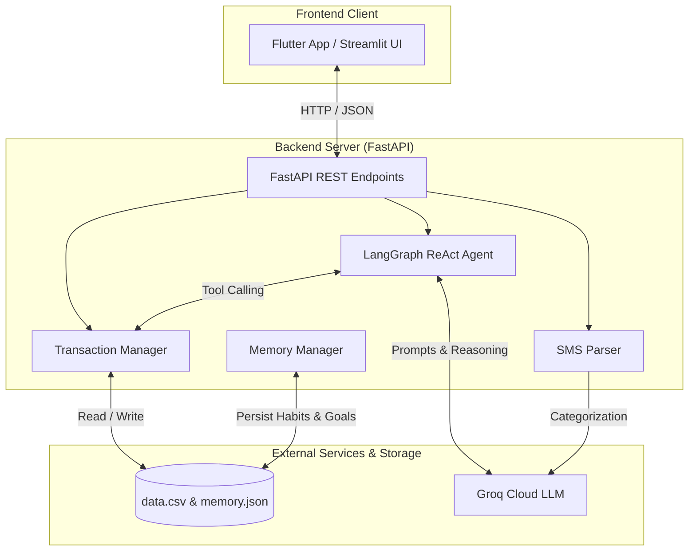

# 💸 Personal Finance Copilot

[](https://www.python.org/)
[](https://fastapi.tiangolo.com/)
[](https://flutter.dev/)
[](https://www.langchain.com/)
[](https://groq.com/)

An agentic AI-powered personal finance assistant designed to track expenses, parse transaction SMS messages, analyze spending patterns, and provide actionable financial advice through an intelligent conversational copilot.

---

## 🌟 Key Features

- **📊 Comprehensive Financial Dashboard**:
  - Live total spend, income, and net balance calculation in Indian Rupees (₹).
  - Category-level breakdown and visual analytics.
  - Anomaly and spending spike alerts (e.g., crossing monthly thresholds, significant month-over-month jumps).

- **🤖 Autonomous ReAct AI Agent**:
  - Built with **LangChain** and **LangGraph** running on **Groq**.
  - Equipped with rich toolkits:
    - `total_spend_tool` & `category_spend_tool`: High-level spend aggregations.
    - `merchant_spend_tool`: Merchant/store-specific spending analytics (e.g., Swiggy, Zomato, Uber, Amazon, DMRC).
    - `search_transactions_tool`: Keyword-based transaction lookup.
    - `monthly_summary_tool`: Month-over-month cashflow comparisons.
    - `insight_tool` & `recommendation_tool`: Automated spending advice and budget health checks.
    - `add_goal_tool`: Financial goal tracking.

- **💬 SMS Transaction Parser**:
  - Automatically parses bank and UPI transaction SMS messages.
  - Extracts amounts, merchant names, and transaction types.
  - Uses LLM classification to categorize transactions (`Food`, `Shopping`, `Transport`, `Bills`, etc.).
  - Built-in duplicate detection before persisting records.

- **🧠 Memory & Habit Detection**:
  - Detects spending behaviors such as weekend overspending patterns.
  - Persists long-term habits and user goals to `memory.json`.

- **📱 Modern Cross-Platform Frontend**:
  - Built with **Flutter** (Android, iOS, Web, Desktop).
  - Dedicated screens for Dashboard analytics, Manual Transaction Management (Add / Edit / Delete), and an AI Chat interface.

- **🖥️ Alternative Streamlit Interface**:
  - Lightweight Streamlit app for quick prototyping, visual charts, and direct AI agent queries.

---

## 🏗️ Architecture & Tech Stack



### Technologies

- **Backend**: Python 3.10+, FastAPI, Uvicorn, LangChain, LangGraph, ChatGroq, Pandas, Pydantic, python-dotenv
- **Frontend**: Flutter / Dart
- **Prototyping UI**: Streamlit
- **Storage**: CSV (`data.csv`) & JSON (`memory.json`)

---

## 📁 Repository Structure

```
personal_finance_copilot/
├── backend/
│   ├── .env.example          # Sample environment variables
│   ├── agent.py              # LangGraph ReAct agent & financial tools
│   ├── app.py                # Streamlit web dashboard
│   ├── backend.py            # FastAPI REST API application
│   ├── data.csv              # Transactions data store
│   ├── memory.json           # User habits and goals store
│   ├── memory_manager.py     # Memory persistence utilities
│   ├── requirements.txt      # Python dependencies
│   ├── sms_parser.py         # Regex + LLM SMS transaction extractor
│   ├── transaction_manager.py# Transaction CRUD operations
│   └── utils.py              # Analytics, summaries, and spending metrics
├── frontend/
│   ├── lib/
│   │   ├── main.dart         # Flutter entry point & bottom navigation
│   │   └── screens/
│   │       ├── dashboard_screen.dart    # Overview metrics & charts
│   │       ├── add_expense_screen.dart  # Transaction management
│   │       └── chat_screen.dart         # Conversational agent UI
│   └── pubspec.yaml          # Flutter dependencies
├── .gitignore
└── README.md
```

---

## 🚀 Getting Started

### Prerequisites

- **Python**: 3.10 or higher
- **Flutter SDK**: 3.x or higher (for the mobile/web frontend)
- **Groq API Key**: Obtain a free key from [Groq Console](https://console.groq.com/)

---

### 1. Backend Setup

1. **Navigate to the backend directory**:
   ```bash
   cd backend
   ```

2. **Create and activate a virtual environment**:
   - On Windows (PowerShell):
     ```powershell
     python -m venv venv
     .\venv\Scripts\Activate.ps1
     ```
   - On Linux / macOS:
     ```bash
     bash
     python3 -m venv venv
     source venv/bin/activate
     ```

3. **Install dependencies**:
   ```bash
   pip install -r requirements.txt
   ```

4. **Configure environment variables**:
   Create a `.env` file inside `backend/`:
   ```env
   GROQ_API_KEY=gsk_your_groq_api_key_here
   ```

5. **Start the FastAPI server**:
   ```bash
   uvicorn backend:app --reload --port 8000
   ```
   The backend API will be running at `http://127.0.0.1:8000`. Interactive Swagger documentation is available at `http://127.0.0.1:8000/docs`.

6. *(Optional)* **Run the Streamlit Dashboard**:
   ```bash
   streamlit run app.py
   ```

---

### 2. Frontend Setup (Flutter)

1. **Navigate to the frontend directory**:
   ```bash
   cd frontend
   ```

2. **Install Flutter packages**:
   ```bash
   flutter pub get
   ```

3. **Launch the application**:
   - Run on Chrome / Web:
     ```bash
     flutter run -d chrome
     ```
   - Run on connected Android / iOS device:
     ```bash
     flutter run
     ```

> **Note**: If running the Flutter app on an Android emulator or physical device, ensure the backend API base URL points to your host IP address (e.g., `http://10.0.2.2:8000` for Android emulator) rather than `localhost`.

---

## 📡 API Reference

| Method | Endpoint | Description |
|---|---|---|
| `GET` | `/` | Health check endpoint |
| `GET` | `/summary` | Returns total spend, income, net balance, category breakdown, and transactions |
| `POST` | `/chat` | Sends a natural language query to the LangGraph ReAct financial agent |
| `POST` | `/add_transaction` | Adds a new transaction (`amount`, `merchant`, `category`, `type`, `date`) |
| `PUT` | `/edit_transaction` | Updates an existing transaction by `id` |
| `DELETE` | `/delete_transaction/{id}` | Deletes a transaction by `id` |

---

## 💬 Example AI Assistant Queries

You can ask the Copilot questions such as:
- *"How much did I spend on Swiggy and Zomato this month?"*
- *"What is my highest spending category?"*
- *"Give me insights on my spending trends and how I can save more."*
- *"Show me my total income and remaining balance."*
- *"Set a goal to save ₹20,000 for emergency fund."*

---

## 🗺️ Roadmap

- [ ] Automatic Android SMS background listener integration.
- [ ] Multi-account and multi-currency support.
- [ ] Database migration (PostgreSQL / SQLite via SQLAlchemy).
- [ ] Recurring subscription detection & notification reminders.
- [ ] Export transactions to CSV / PDF reports.

---

## 📄 License

This project is licensed under the MIT License. Feel free to use, modify, and distribute.
