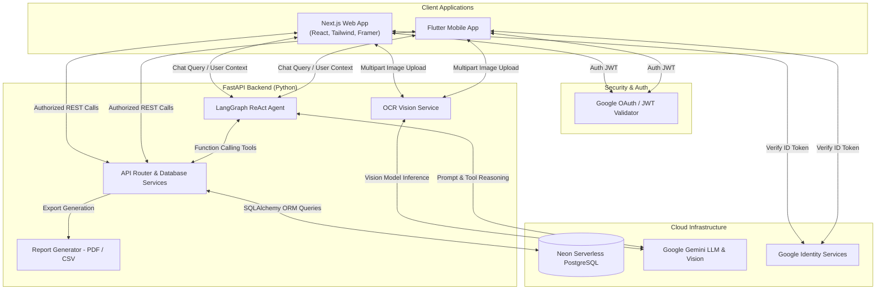

# 💸 Personal Finance Copilot

[](https://www.python.org/)
[](https://fastapi.tiangolo.com/)
[](https://neon.tech/)
[](https://nextjs.org/)
[](https://flutter.dev/)
[](https://www.langchain.com/)

An intelligent, multi-tenant agentic personal finance copilot designed to track expenses, scan receipts using AI vision, parse SMS banking alerts, manage recurring subscriptions with one-tap payments, monitor budgets & goals, generate PDF/CSV reports, and provide financial insights through an autonomous conversational AI agent.

The platform offers two robust frontends:
1. **Next.js Web App**: A premium, responsive, glassmorphic SaaS interface featuring dark mode, animations, and beautiful data visualizations.
2. **Flutter Mobile App**: A cross-platform mobile app for iOS and Android.

---

## 🚀 Key Features

- **🛡️ Google OAuth 2.0 & Multi-Tenancy**:
  - Seamless Google Sign-In with backend server-side Google ID token verification.
  - Secure stateless JWT issuance and persistent auth session management.
  - Complete data isolation per authenticated user (`user_id`).

- **☁️ Cloud Database (PostgreSQL on Neon)**:
  - Powered by serverless **Neon PostgreSQL** via **SQLAlchemy ORM**.
  - Production-ready schema with models for `User`, `Transaction`, `Subscription`, `Budget`, `Goal`, and `ChatMessage`.

- **🤖 LangGraph Conversational Agent**:
  - Full multi-turn conversational context powered by **LangGraph** `MemorySaver` thread checkpointing (`thread_id = user_id`).
  - Chat history stored persistently in Neon PostgreSQL (`chat_messages` table) per user.
  - **Tool Use**: The agent can autonomously run SQL queries against your data to answer complex questions (e.g., "Am I on budget for food?").
  - **1-Tap "New Chat"**: Starts a fresh slate, wipes working memory, and provides interactive starter prompt suggestions.

- **📸 Multimodal Receipt Scanning (Drag & Drop)**:
  - Users can upload or **drag & drop** receipt images directly into the chat interface or transaction modal.
  - Uses Google Gemini Vision (`gemini-1.5-flash`) via the backend `/scan_receipt` endpoint to auto-extract the merchant, amount, category, and date directly into a transaction draft.

- **🎨 Premium UI / UX (Web)**:
  - **Glassmorphism**: Beautiful frosted-glass sidebar, modals, and sticky headers (`backdrop-blur`).
  - **Dark Mode**: Fully supported system/light/dark mode toggle with meticulously chosen contrast semantic colors (`next-themes` + Tailwind 4).
  - **Data Visualization**: Interactive Recharts (Area charts for cash flow, hollow Doughnut charts for categorizations).
  - **Micro-interactions**: `framer-motion` sliding active tabs, bouncy AI chat bubbles, and a celebratory `react-confetti` explosion when you successfully set a financial goal.

- **💳 Subscriptions & Budgets**:
  - Automatically identifies if subscriptions are *Overdue* or *Due Soon* with glowing warning cards.
  - One-Tap "Pay Subscription" instantly logs a transaction and rolls the billing cycle forward.
  - Dynamic visual budget progress bars (Emerald, Amber, Rose status depending on spending limits).

- **📄 Export & Reporting**:
  - 1-Click download for full financial histories in `.CSV`.
  - Richly formatted PDF statement generation (`ReportLab`) featuring summary metrics.

---

## 🏗️ System Architecture


```mermaid
graph TD
    %% Frontend Applications
    subgraph Client["Client Applications"]
        UI_Web["Next.js Web App\n(React, Tailwind, Framer)"]
        UI_Mob["Flutter Mobile App"]
    end

    %% Security
    subgraph Auth["Security & Auth"]
        G[Google OAuth / JWT Validator]
    end

    %% Backend Server
    subgraph Backend["FastAPI Backend (Python)"]
        H[API Router & Database Services]
        I[LangGraph ReAct Agent]
        J[OCR Vision Service]
        K[Report Generator - PDF / CSV]
    end

    %% External & Cloud Infrastructure
    subgraph Cloud["Cloud Infrastructure"]
        L[(Neon Serverless PostgreSQL)]
        M[Google Gemini LLM & Vision]
        N[Google Identity Services]
    end

    UI_Web & UI_Mob <-->|Verify ID Token| N
    UI_Web & UI_Mob <-->|Auth JWT| G
    UI_Web & UI_Mob <-->|Authorized REST Calls| H
    UI_Web & UI_Mob <-->|Multipart Image Upload| J
    UI_Web & UI_Mob <-->|Chat Query / User Context| I
    
    J <-->|Vision Model Inference| M
    I <-->|Function Calling Tools| H
    I <-->|Prompt & Tool Reasoning| M
    H <-->|SQLAlchemy ORM Queries| L
    H -->|Export Generation| K
```

---

## 📂 Repository Structure

```
personal_finance_copilot/
├── backend/
│   ├── .env.example          # Sample backend environment variables
│   ├── agent.py              # Multi-tenant LangGraph ReAct agent & tools
│   ├── auth.py               # Google OAuth verification & JWT helpers
│   ├── backend.py            # FastAPI main app, router, & endpoints
│   ├── crypto.py             # Application-level DB encryption utilities (Fernet)
│   ├── database.py           # SQLAlchemy engine & Neon Postgres configuration
│   ├── db_services.py        # Database CRUD services (Transactions, Subscriptions, Budgets, Goals, Chat)
│   ├── models.py             # SQLAlchemy ORM models
│   ├── ocr_service.py        # Gemini Vision AI receipt parsing service
│   ├── report_generator.py   # PDF (ReportLab) and CSV generation utilities
│   ├── requirements.txt      # Python dependencies
│   ├── utils.py              # Spending calculations & trend analysis
├── web/                      # Next.js 15 Web Frontend (App Router)
│   ├── src/app/(app)/       
│   │   ├── dashboard/        # Overview metrics, charts, AI insights
│   │   ├── transactions/     # Interactive data table & receipt uploads
│   │   ├── budgets/          # Category tracking & goals with confetti
│   │   ├── subscriptions/    # Recurring bills with due-date alerts
│   │   ├── chat/             # AI agent conversational UI with drag & drop
│   │   └── layout.tsx        # Global glassmorphic Sidebar & Header
│   ├── package.json          # npm dependencies (framer-motion, recharts, shadcn/ui)
│   └── globals.css           # Tailwind v4 configuration & semantic theme variables
├── frontend/                 # Legacy Flutter Mobile App
│   └── lib/main.dart         # Flutter entrypoint
├── .gitignore
└── README.md
```

---

## ⚙️ Environment Variables

Create a `.env` file in the `backend/` directory (or add them as Environment Variables in your Railway / deployment dashboard):

```env
# Neon Serverless PostgreSQL Database Connection String
DATABASE_URL=postgresql://<user>:<password>@<ep-pooler-id>.neon.tech/<dbname>?sslmode=require

# Google Gemini API Key
GEMINI_API_KEY=your_gemini_api_key_here

# JWT Secret Key for token signing (REQUIRED for production)
JWT_SECRET=your_super_secret_jwt_key_here

# Google OAuth Web Client ID (REQUIRED for production OAuth audience check)
GOOGLE_CLIENT_ID=your_google_web_client_id.apps.googleusercontent.com

# Database Application-Level Encryption Key (32-byte Fernet key)
ENCRYPTION_KEY=your_generated_fernet_key_here
```

---

## 🛠️ Setup & Execution

### 1. Backend Setup (FastAPI)

1. **Navigate to the backend directory**:
   ```bash
   cd backend
   ```

2. **Create and activate a virtual environment**:
   ```powershell
   python -m venv venv
   .\venv\Scripts\Activate.ps1
   ```

3. **Install dependencies**:
   ```bash
   pip install -r requirements.txt
   ```

4. **Run the FastAPI server**:
   ```bash
   uvicorn backend:app --reload --port 8000
   ```
   Interactive Swagger API documentation is available at `http://127.0.0.1:8000/docs`.

---

### 2. Web Frontend Setup (Next.js)

1. **Navigate to the web directory**:
   ```bash
   cd web
   ```

2. **Install dependencies**:
   ```bash
   npm install
   ```

3. **Configure API Base URL**:
   Ensure `src/lib/api.ts` points to your backend (default is `http://127.0.0.1:8000`). Make sure to set `NEXT_PUBLIC_GOOGLE_CLIENT_ID` in `.env.local` if deploying to production.

4. **Run the development server**:
   ```bash
   npm run dev
   ```
   Access the app at `http://localhost:3000`.

---

### 3. Mobile Frontend Setup (Flutter)

1. **Navigate to the frontend directory**:
   ```bash
   cd frontend
   ```

2. **Install packages & run**:
   ```bash
   flutter pub get
   flutter run
   ```

---

## 📜 License

This project is licensed under the MIT License. Feel free to use, modify, and distribute.
