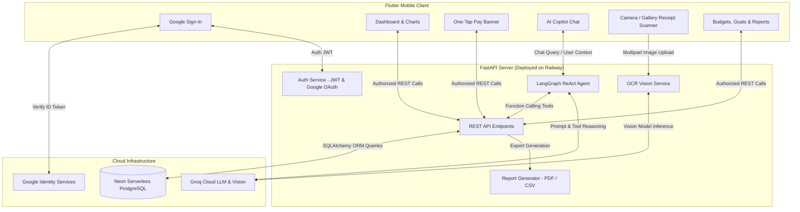

# 💸 Personal Finance Copilot

[](https://www.python.org/)
[](https://fastapi.tiangolo.com/)
[](https://neon.tech/)
[](https://flutter.dev/)
[](https://www.langchain.com/)
[](https://groq.com/)

An intelligent, multi-tenant agentic personal finance copilot designed to track expenses, scan receipts using AI vision, parse SMS banking alerts, manage recurring subscriptions with one-tap payments, monitor budgets & goals, generate PDF/CSV reports, and provide financial insights through an autonomous conversational AI agent.

---

## 🌟 Key Features

- **🔐 Google OAuth 2.0 & Multi-Tenancy**:
  - Seamless Google Sign-In on mobile with backend server-side Google ID token verification.
  - Secure stateless JWT issuance and persistent auth session management.
  - Complete data isolation per authenticated user (`user_id`).

- **🐘 Cloud Database (PostgreSQL on Neon)**:
  - Powered by serverless **Neon PostgreSQL** via **SQLAlchemy ORM**.
  - Production-ready schema with models for `User`, `Transaction`, `Subscription`, `Budget`, `Goal`, `Habit`, and `ChatMessage`.
  - Automatic fallback to local SQLite for offline development.

- **💬 Persistent Cloud Chat & Conversational Memory**:
  - Full multi-turn conversational context powered by **LangGraph** `MemorySaver` thread checkpointing (`thread_id = user_id`).
  - Chat history stored persistently in Neon PostgreSQL (`chat_messages` table) per user.
  - **Cold-Start Resilience**: Context is automatically restored directly from PostgreSQL even if the backend server restarts.
  - **1-Tap "New Chat"**: Starts a fresh slate, wipes working memory, and provides interactive starter prompt suggestions.

- **📸 AI OCR Receipt Scanning (Groq Vision)**:
  - Real-time receipt parsing powered by high-speed multimodal AI (`qwen/qwen3.8-27b` via Groq).
  - Capture receipts via camera or pick existing bills/invoices from gallery.
  - Automatically extracts:
    - **Merchant Name** (e.g., Starbucks, Walmart, Reliance Retail)
    - **Total Amount** (numeric float)
    - **Transaction Date** (`YYYY-MM-DD`)
    - **Expense Category** (categorized into `Food`, `Shopping`, `Bills`, `Health`, etc.)
  - Pre-fills the manual expense form instantly for 1-tap review and saving.

- **🔒 Enterprise-Grade Security & Privacy**:
  - **Application-Level Database Encryption**: Sensitive PII and financial records (amounts, merchants, categories, and chat messages) are encrypted using Fernet symmetric encryption *before* storage in PostgreSQL.
  - **Hardened API Security**: Strict rate limiting via `slowapi`, bounded file upload chunks to prevent OOM attacks, and strictly validated Pydantic API payload schemas.
  - **Secure Token Handling**: No credentials/JWT leaks in URL parameters or wildcard CORS vulnerabilities. Strict Google OAuth Confused-Deputy Audience verification.

- **🤖 Autonomous ReAct AI Copilot**:
  - Built with **LangGraph** and **Groq** high-speed LLM inference.
  - Context-aware multi-turn financial assistant equipped with live database tools:
    - `total_spend_tool` & `category_spend_tool`: High-level spend aggregations.
    - `merchant_spend_tool`: Merchant-specific analytics (e.g., Swiggy, Amazon, Uber, Zomato).
    - `search_transactions_tool`: Keyword-based transaction lookup.
    - `monthly_summary_tool`: Month-over-month cashflow comparisons.
    - `insight_tool` & `recommendation_tool`: Automated spending advice and budget health checks.
    - `add_goal_tool`: Dynamic savings target tracking.

- **🔁 Subscriptions Tracker & One-Tap "Mark as Paid"**:
  - Keep track of recurring expenses (monthly or yearly cycles).
  - Upcoming bills banner directly on the Dashboard alerting you to bills due within 14 days or overdue.
  - **One-Tap "Mark as Paid"**:
    - Automatically records a debit expense in your transaction ledger with today's date.
    - Automatically rolls the bill's next due date forward to the next billing cycle (next month or year).

- **🎯 Budgets & Financial Goals**:
  - Set category spending caps and track progress against actual expenses.
  - Define savings goals with target amounts and target dates.

- **📄 Statement & Report Exports**:
  - Instant one-click CSV export of transaction history.
  - Professional, color-coded PDF financial statements generated dynamically using **ReportLab**.

- **💬 SMS Transaction Parser**:
  - Automatically parse UPI and debit/credit card bank SMS notifications.
  - Extracts amount, merchant, and classification (`Food`, `Shopping`, `Transport`, `Bills`, etc.) using Groq.

- **📱 Cross-Platform Flutter Mobile Client**:
  - Modern Material 3 dark/light responsive interface.
  - Interactive month picker, visual expense breakdowns, quick transaction editing/deletion, and bottom navigation.

---

## 🏗️ Architecture & Flow


```mermaid
flowchart TD
    subgraph Frontend["Flutter Mobile Client"]
        A[Google Sign-In]
        B[Dashboard & Charts]
        C[One-Tap Pay Banner]
        D[AI Copilot Chat]
        E[Camera / Gallery Receipt Scanner]
        F[Budgets, Goals & Reports]
    end

    subgraph Backend["FastAPI Server (Deployed on Railway)"]
        G[Auth Service - JWT & Google OAuth]
        H[REST API Endpoints]
        I[LangGraph ReAct Agent]
        J[OCR Vision Service]
        K[Report Generator - PDF / CSV]
    end

    subgraph Cloud["Cloud Infrastructure"]
        L[(Neon Serverless PostgreSQL)]
        M[Groq Cloud LLM & Vision]
        N[Google Identity Services]
    end

    A <-->|Verify ID Token| N
    A <-->|Auth JWT| G
    B & C & F <-->|Authorized REST Calls| H
    D <-->|Chat Query / User Context| I
    E -->|Multipart Image Upload| J
    J <-->|Vision Model Inference| M
    I <-->|Function Calling Tools| H
    I <-->|Prompt & Tool Reasoning| M
    H <-->|SQLAlchemy ORM Queries| L
    H -->|Export Generation| K
```

---

## 📁 Repository Structure

```
personal_finance_copilot/
├── backend/
│   ├── .env.example          # Sample backend environment variables
│   ├── agent.py              # Multi-tenant LangGraph ReAct agent & tools
│   ├── auth.py               # Google OAuth verification & JWT helpers
│   ├── backend.py            # FastAPI main app, router, & endpoints
│   ├── crypto.py             # Application-level DB encryption utilities (Fernet)
│   ├── database.py           # SQLAlchemy engine & Neon Postgres configuration
│   ├── db_services.py        # Database CRUD services (Transactions, Subscriptions, Budgets, Goals, Chat)
│   ├── models.py             # SQLAlchemy ORM models (User, Transaction, Subscription, Budget, Goal, ChatMessage)
│   ├── ocr_service.py        # Groq Vision AI receipt parsing service
│   ├── report_generator.py   # PDF (ReportLab) and CSV generation utilities
│   ├── requirements.txt      # Python dependencies (python-multipart, psycopg2, reportlab, etc.)
│   ├── sms_parser.py         # Regex + LLM SMS transaction extractor
│   ├── transaction_manager.py# Helper analytics & metric calculations
│   └── utils.py              # Spending calculations & trend analysis
├── frontend/
│   ├── lib/
│   │   ├── main.dart                 # App initialization & navigation
│   │   ├── services/
│   │   │   ├── api_client.dart       # HTTP client with JWT interceptor & multipart support
│   │   │   └── auth_service.dart     # Google Sign-In & token storage
│   │   └── screens/
│   │       ├── auth_screen.dart          # Google login screen
│   │       ├── dashboard_screen.dart     # Overview metrics, upcoming bills, one-tap pay
│   │       ├── chat_screen.dart          # Conversational agent UI with persistent history & New Chat
│   │       ├── add_expense_screen.dart   # Transaction entry, SMS parsing & OCR receipt scan
│   │       ├── subscriptions_screen.dart # Recurring bill management & one-tap pay
│   │       ├── budgets_screen.dart       # Category spending budgets
│   │       ├── goals_screen.dart         # Financial savings targets
│   │       └── export_screen.dart        # PDF / CSV report downloads
│   └── pubspec.yaml          # Flutter dependencies (image_picker, fl_chart, etc.)
├── .gitignore
└── README.md
```

---

## ⚙️ Environment Variables

Create a `.env` file in the `backend/` directory (or add them as Environment Variables in your Railway / deployment dashboard):

```env
# Neon Serverless PostgreSQL Database Connection String
DATABASE_URL=postgresql://<user>:<password>@<ep-pooler-id>.neon.tech/<dbname>?sslmode=require

# Groq Cloud API Key
GROQ_API_KEY=gsk_your_groq_api_key_here

# JWT Secret Key for token signing (REQUIRED for production)
JWT_SECRET=your_super_secret_jwt_key_here

# Google OAuth Web Client ID (REQUIRED for production OAuth audience check)
GOOGLE_CLIENT_ID=your_google_web_client_id.apps.googleusercontent.com

# Database Application-Level Encryption Key (32-byte Fernet key)
ENCRYPTION_KEY=your_generated_fernet_key_here
```

> **Note**: For mobile Google Sign-In, configure `GOOGLE_CLIENT_ID` in `frontend/lib/services/auth_service.dart` as the `serverClientId`, and register your Android Client ID with package name `com.example.finance_copilot_app` and debug SHA-1 in the Google Cloud Console.

---

## 🚀 Setup & Execution

### 1. Backend Setup

1. **Navigate to the backend directory**:
   ```bash
   cd backend
   ```

2. **Create and activate a virtual environment**:
   - Windows (PowerShell):
     ```powershell
     python -m venv venv
     .\venv\Scripts\Activate.ps1
     ```
   - Linux / macOS:
     ```bash
     python3 -m venv venv
     source venv/bin/activate
     ```

3. **Install dependencies**:
   ```bash
   pip install -r requirements.txt
   ```

4. **Run the FastAPI server**:
   ```bash
   uvicorn backend:app --reload --port 8000
   ```
   Interactive Swagger API documentation is available at `http://127.0.0.1:8000/docs`.

---

### 2. Frontend Setup (Flutter)

1. **Navigate to the frontend directory**:
   ```bash
   cd frontend
   ```

2. **Install Flutter packages**:
   ```bash
   flutter pub get
   ```

3. **Configure API Base URL**:
   In `frontend/lib/services/api_client.dart`:
   - For local emulator: `http://10.0.2.2:8000`
   - For local device / LAN: `http://<your-lan-ip>:8000`
   - For cloud backend (Railway): `https://backend-production-4ca2.up.railway.app`

4. **Launch the application**:
   ```bash
   flutter run
   ```

---

## 📡 API Reference

All protected endpoints require the HTTP header: `Authorization: Bearer <JWT_TOKEN>` (or query parameter `?token=<JWT_TOKEN>` for export downloads).

| Method | Endpoint | Description |
|---|---|---|
| `POST` | `/auth/google` | Verifies Google ID token, registers/logs in user, returns JWT |
| `GET` | `/` | Health check endpoint |
| `GET` | `/summary` | Aggregated user metrics, monthly totals, category breakdown, upcoming bills |
| `POST` | `/chat` | Conversational query to the LangGraph ReAct agent (persisted with memory) |
| `GET` | `/chat/history` | Fetches user's previous conversation history from Neon PostgreSQL |
| `DELETE` | `/chat/history` | Clears conversation history and resets agent conversational memory |
| `POST` | `/scan_receipt` | **OCR Receipt Scanner**: Accepts multipart image file and extracts merchant, amount, date, and category |
| `POST` | `/add_transaction` | Records a new credit or debit transaction |
| `PUT` | `/edit_transaction` | Updates an existing transaction |
| `DELETE` | `/delete_transaction/{id}` | Deletes a transaction by ID |
| `GET` | `/subscriptions` | Lists all recurring subscriptions and bills |
| `POST` | `/subscriptions` | Creates a new recurring subscription |
| `DELETE` | `/subscriptions/{id}` | Removes a subscription |
| `POST` | `/pay_subscription/{id}` | **One-Tap Pay**: Logs transaction as expense and advances billing cycle |
| `GET` | `/budgets` | Returns category budget limits and spent amounts |
| `POST` | `/budgets` | Creates or updates a category budget limit |
| `GET` | `/goals` | Lists savings goals and progress |
| `POST` | `/goals` | Creates or updates a savings goal |
| `GET` | `/export/csv` | Downloads CSV export of user transactions |
| `GET` | `/export/pdf` | Generates and downloads a styled PDF financial statement |

---

## 💬 Example Copilot Prompts

Try asking the AI Assistant:
- *"How much did I spend on dining and groceries this month?"*
- *"What is my highest spending category?"*
- *"Am I on track with my monthly budget?"*
- *"Set a goal to save ₹50,000 for vacation."*
- *"Give me tips on how to cut down my discretionary spending."*

---

## 📄 License

This project is licensed under the MIT License. Feel free to use, modify, and distribute.
